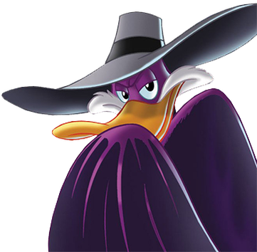
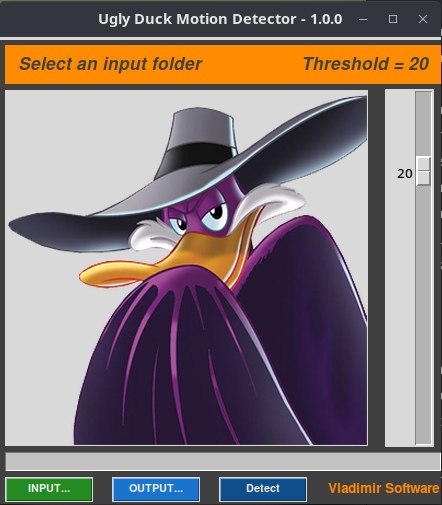

# UGLY DUCK #

Ugly Duck is a video analysis app that allows user to select an area of a video file (CCTV, webcam, security cam, etc.) to detect motion. The sensitivity of the motion detection could be adjust with threshold.



### Goal ###

The app was designed following the [Model-View-Controller (MVC) pattern](https://pt.wikipedia.org/wiki/MVC)

The goal is to detect motion in a sequence of static images (video frames). This is accomplished by comparing two in a row, first resizing them to 500 pixels of width, then graying them, after that, create a new image with the absolute difference of between the two images. At last, with this new image use a dilated 
binary threshold and find the contours. If the area of any contour is bigger than the threshold chosen, there is motion.

### Design ###

The app uses an Object Oriented approach and was designed following the [Model-View-Controller (MVC) pattern](https://pt.wikipedia.org/wiki/MVC)

Classes:

- Model
	- MotionDetector
	- ReadFoto
	- SaveFoto
- View
	- GUI (Graphical User Interface)
	- CLI (Command Line interface)
- Controller
	- Controller

### Usage ###
To run the app, in Windows double click in ```UglyDuck.exe```, in other operating systems:
```terminal
$ python3 detetor_movimentos.py
```
If it throws some errors because of the missing requirements, you need to install them:
```terminal
$ pip3 install -r requirements.txt
```




After chosen the input video file, it will open the first frame to choose the area to do motion detection.

### License ###

